# Recursive Language Models (RLM) Architecture in Chat Module

**Based on:** "Recursive Language Models" (Zhang et al., 2026) - Paper: `2512.24601v2.pdf`

## Overview

This document explains how Recursive Language Models (RLMs) work and how they're integrated into our chat module to handle arbitrarily long contexts by treating prompts as external environments.

---

## Top-Down Architecture: RLM in Chat Module

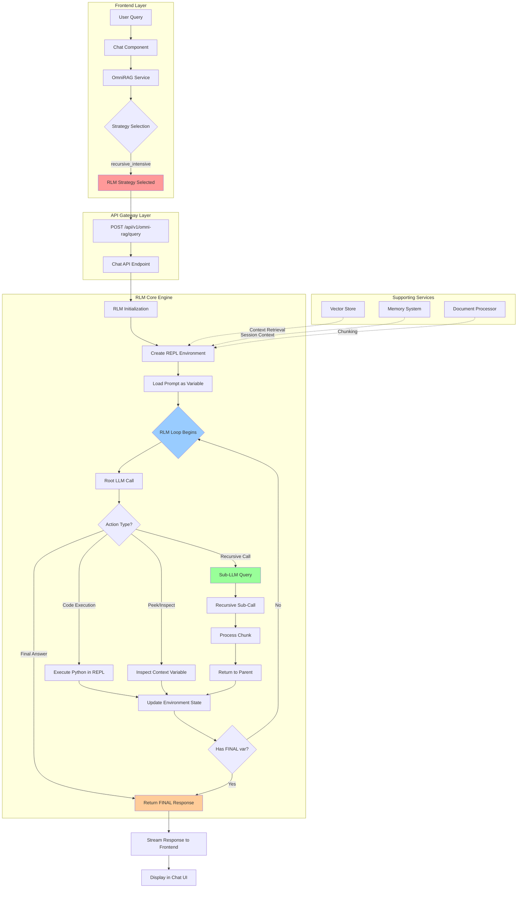

---

## Core RLM Algorithm (From Paper)

```mermaid
flowchart TD
    subgraph "Algorithm 1: Recursive Language Model"
        START[Input: Prompt P] --> INIT[Initialize REPL Environment E]
        INIT --> LOADP[Load P as variable 'context']
        LOADP --> ADDFN[Add sub_RLM function to E]
        ADDFN --> META[Create metadata: length, preview]
        META --> HIST[Initialize history = Metadata only]
        
        HIST --> LOOP{RLM Loop}
        
        LOOP --> LLM[code ← LLM_M history]
        LLM --> EXEC[state, stdout ← REPL E, code]
        EXEC --> UPDATE[history ← history || code || Metadata stdout]
        
        UPDATE --> CHECK{state FINAL set?}
        CHECK -->|No| LOOP
        CHECK -->|Yes| RETURN[return state FINAL]
    end

    style LOOP fill:#e6f3ff
    style LLM fill:#ffe6e6
    style CHECK fill:#e6ffe6
```

---

## Key Design Principles

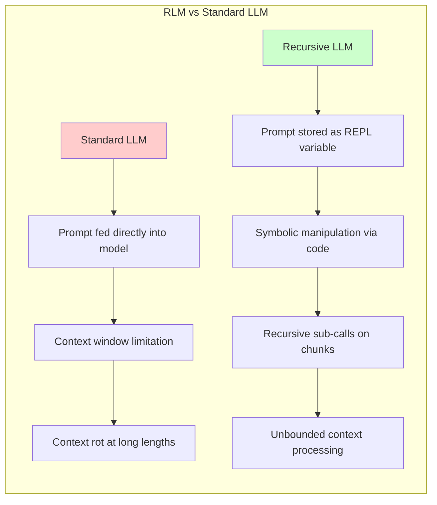

### Three Critical Differences from Standard Scaffolds:

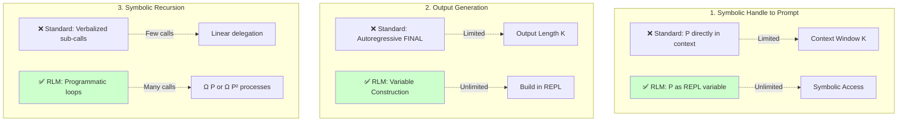

---

## Implementation in Your Chat Module

### Current Integration Points

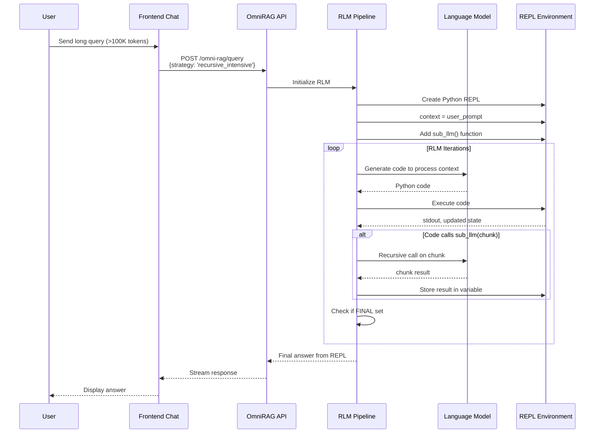

---

## REPL Environment Structure

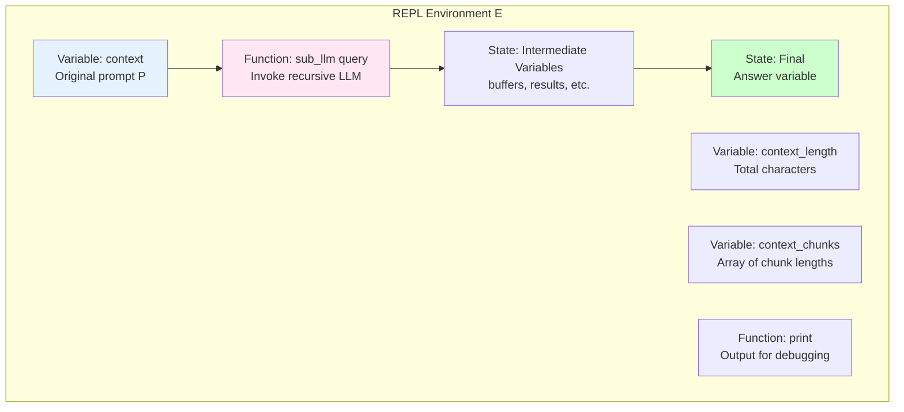

---

## Example: Processing Long Document

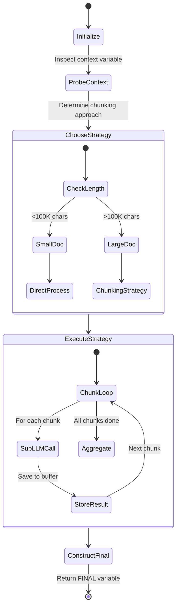

---

## Complexity Scaling Behavior

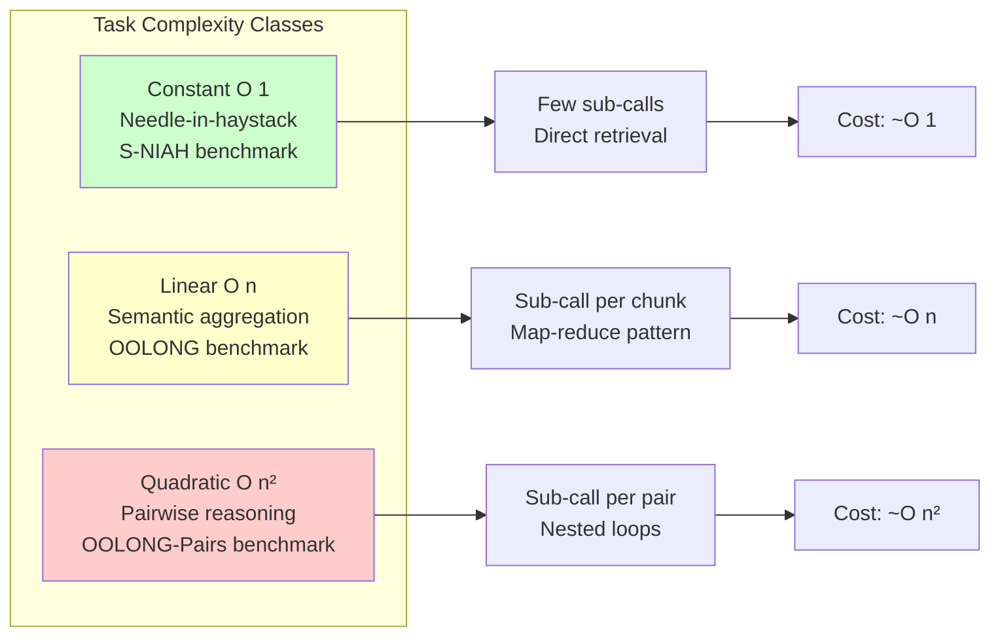

---

## Performance Characteristics (From Paper)

### Context Length vs Performance

```mermaid
graph TD
    subgraph "Standard LLM Performance"
        S1[8K tokens: 100%] --> S2[16K tokens: 90%]
        S2 --> S3[33K tokens: 80%]
        S3 --> S4[66K tokens: 60%]
        S4 --> S5[131K tokens: 40%]
        S5 --> S6[262K tokens: 20%]
        S6 --> S7[>272K: FAILS]
    end

    subgraph "RLM Performance"
        R1[8K tokens: 95%] --> R2[16K tokens: 95%]
        R2 --> R3[33K tokens: 95%]
        R3 --> R4[66K tokens: 95%]
        R4 --> R5[131K tokens: 95%]
        R5 --> R6[262K tokens: 95%]
        R6 --> R7[524K tokens: 95%]
        R7 --> R8[1M+ tokens: 90%+]
    end

    style S7 fill:#ff0000
    style R8 fill:#00ff00
```

---

## Integration with Your Existing RAG Pipeline

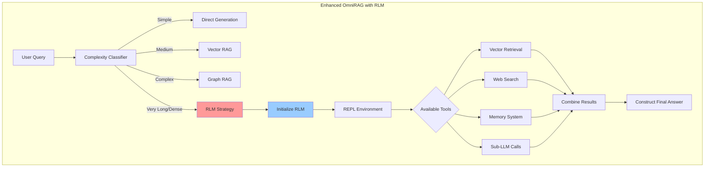

---

## Emergent Patterns in RLM Trajectories

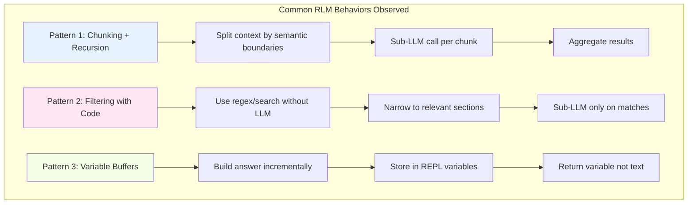

---

## Cost Analysis

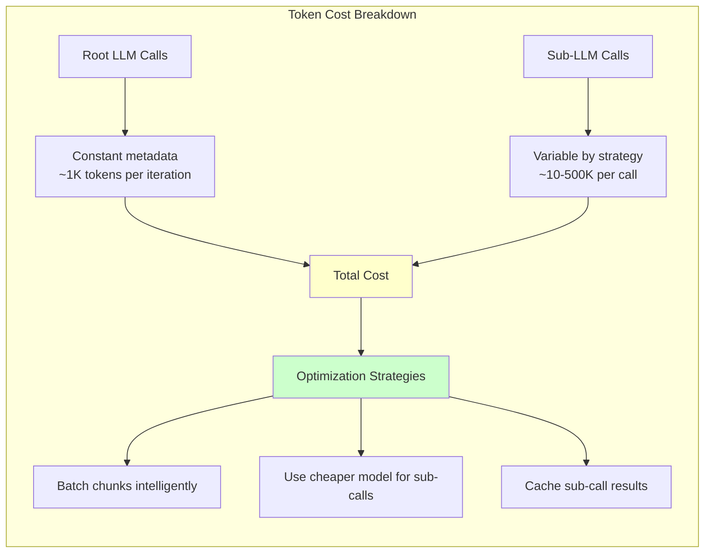

---

## Configuration in Your System

### Backend Configuration (`backend/app/services/rag/pipeline.py`)

```python
class RLMConfig:
    max_recursion_depth: int = 1  # Paper uses depth=1
    chunk_size: int = 100000  # ~30K tokens
    max_iterations: int = 20  # Root LLM loop limit
    sub_model: str = "gpt-4o-mini"  # Cheaper for sub-calls
    root_model: str = "gpt-4o"  # Stronger for orchestration
    enable_caching: bool = True
    timeout_per_call: int = 120
```

### Frontend Strategy Selection

```typescript
interface RLMOptions {
  strategy: 'recursive_intensive';
  max_context_length?: number;  // Auto-trigger threshold
  enable_streaming?: boolean;
  chunk_strategy?: 'semantic' | 'fixed' | 'adaptive';
}
```

---

## System Prompt Structure for RLM

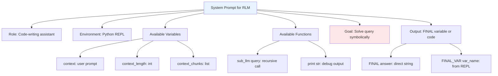

---

## Recommendations for Your Implementation

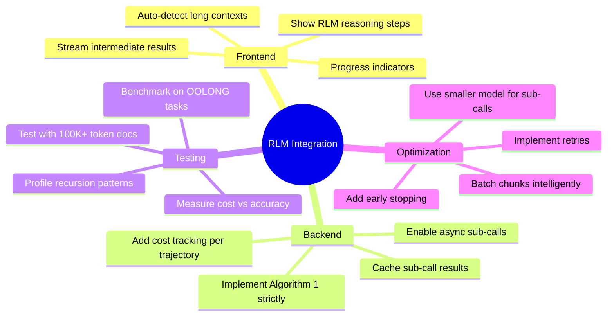

---

## Future Enhancements

1. **Native RLM Training**: Fine-tune model specifically for recursive behavior (paper shows 28.3% improvement)
2. **Asynchronous Sub-Calls**: Parallelize independent sub-LLM queries
3. **Deeper Recursion**: Allow sub-calls to make their own sub-calls (depth > 1)
4. **Cost Prediction**: Estimate trajectory cost before execution
5. **Hybrid Approaches**: Combine RLM with graph RAG for knowledge-intensive tasks

---

## References

- **Paper**: Zhang et al., "Recursive Language Models" (arXiv:2512.24601v2, 2026)
- **Code**: https://github.com/alexzhang13/rlm
- **Your Codebase**: 
  - `backend/app/services/rag/pipeline.py` - RAG pipeline
  - `frontend/src/services/omniRag.ts` - OmniRAG service
  - `backend/app/api/v1/chat.py` - Chat API

---

## Quick Start Integration

### 1. Enable RLM in Chat Request

```typescript
const response = await omniRagService.query({
  query: "Analyze this 200K token document...",
  strategy: 'recursive_intensive',
  session_id: sessionId
});
```

### 2. Backend Detects RLM Strategy

```python
if strategy == "recursive_intensive":
    result = await rlm_pipeline.process(query, context)
```

### 3. RLM Processes with REPL

See Algorithm 1 diagram above for execution flow.

---

**This architecture enables your chat module to handle arbitrarily long contexts (10M+ tokens) while maintaining high quality and reasonable costs.**
