# Standalone Mermaid Diagrams - Ready for Export

This file contains all mermaid diagrams in standalone format for easy export to PNG/PDF/SVG for your research paper.

---

## Diagram 1: Code Lab System Architecture

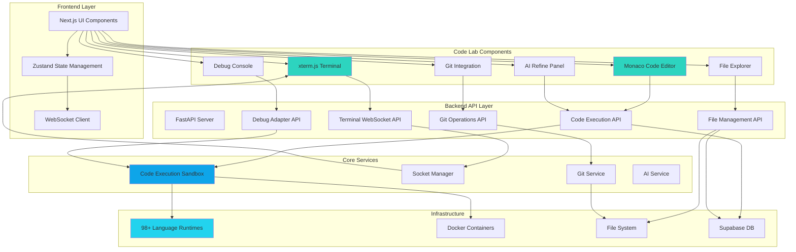

---

## Diagram 2: Code Execution Sequence

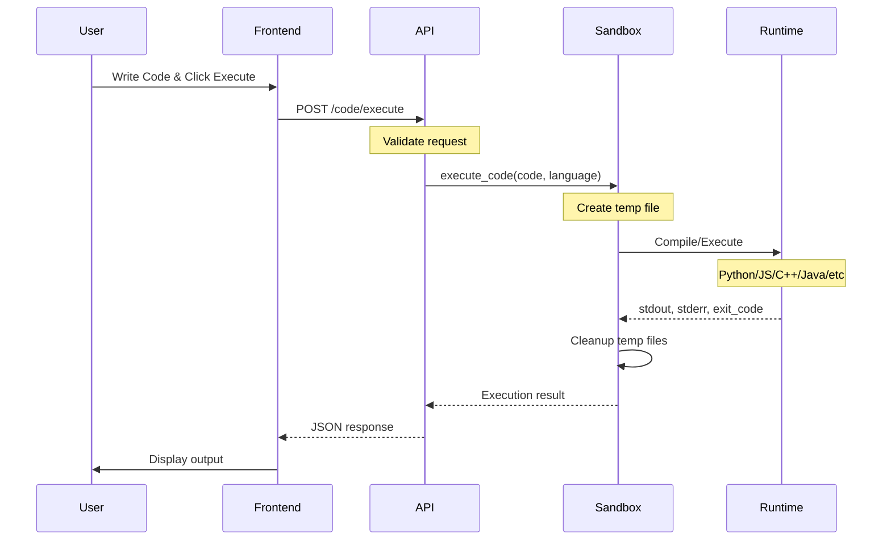

---

## Diagram 3: Terminal WebSocket Communication

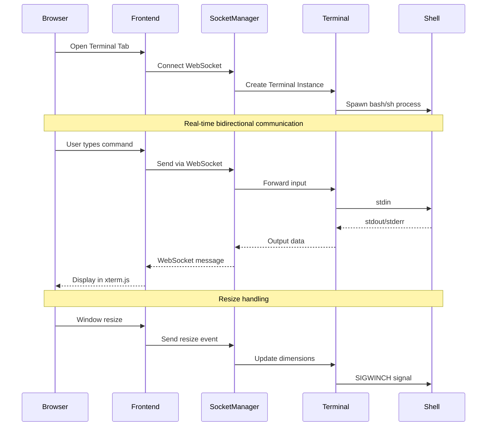

---

## Diagram 4: Git Integration Workflow

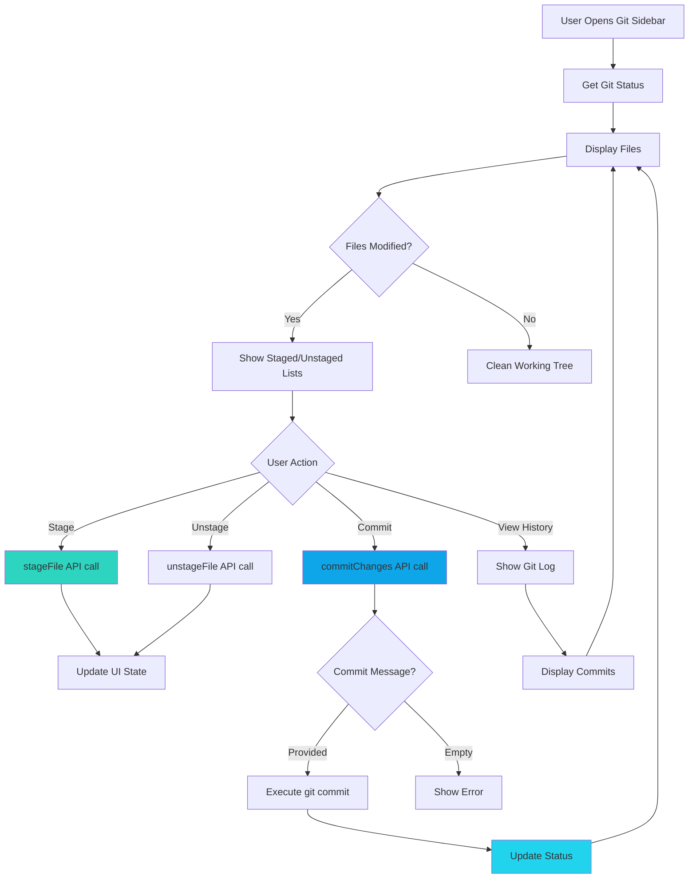

---

## Diagram 5: AI Code Assistance

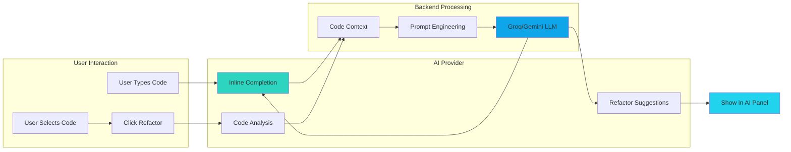

---

## Diagram 6: Debug Session State Machine

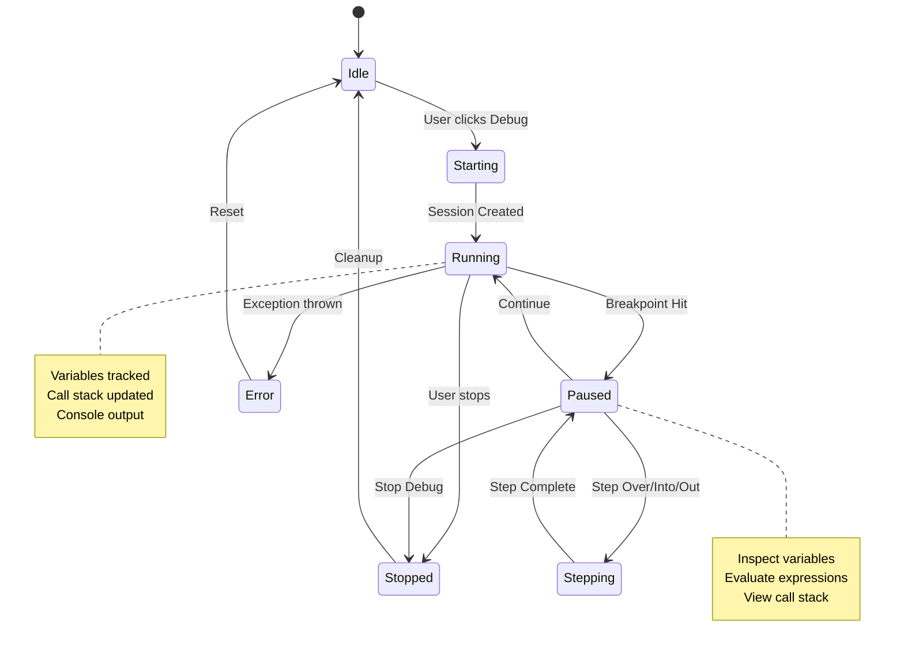

---

## Diagram 7: Full Stack Architecture

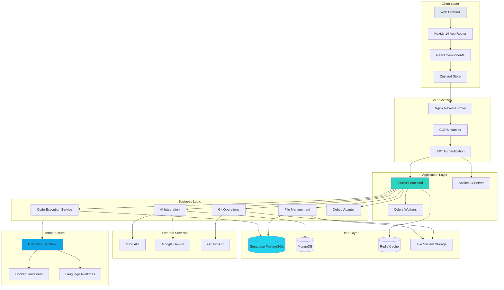

---

## Diagram 8: Data Flow - Code Execution

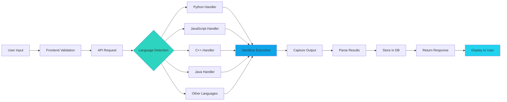

---

## Diagram 9: Component Hierarchy

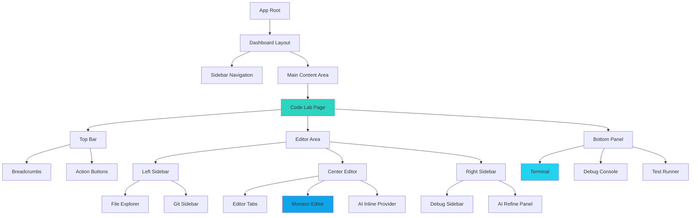

---

## Diagram 10: RAG Architecture (from existing docs)

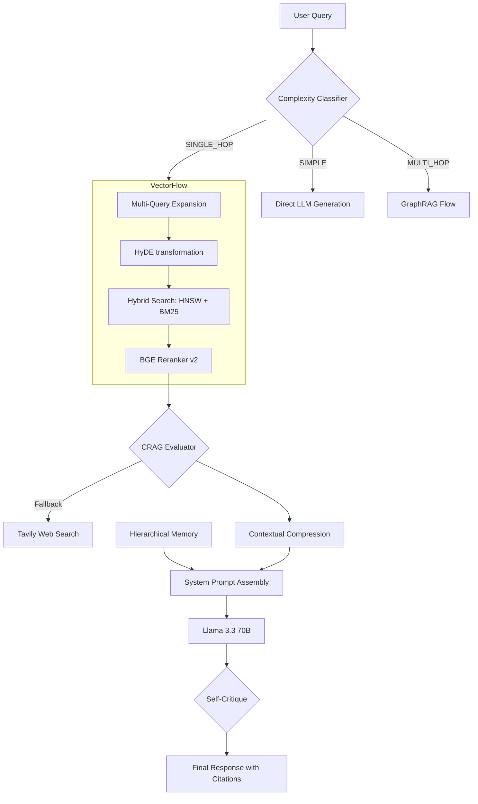

---

## Diagram 11: API Endpoints Mind Map

```mermaid
mindmap
  root((Code Lab API))
    Code Execution
      POST /execute
      POST /ai/complete
      POST /ai/refactor
      POST /ai/analyze
    File Management
      GET /files
      POST /files
      GET /files/{id}
      PATCH /files/{id}
      DELETE /files/{id}
    Git Operations
      GET /git/status
      POST /git/commit
      GET /git/branches
      GET /git/log
      POST /git/stage
      POST /git/unstage
    Terminal
      WebSocket /terminal
      POST /terminal/execute
    Debug
      POST /debug/start
      POST /debug/stop
      POST /debug/breakpoint
      POST /debug/continue
      POST /debug/step
      GET /debug/variables
```

---

## Diagram 12: Security Architecture

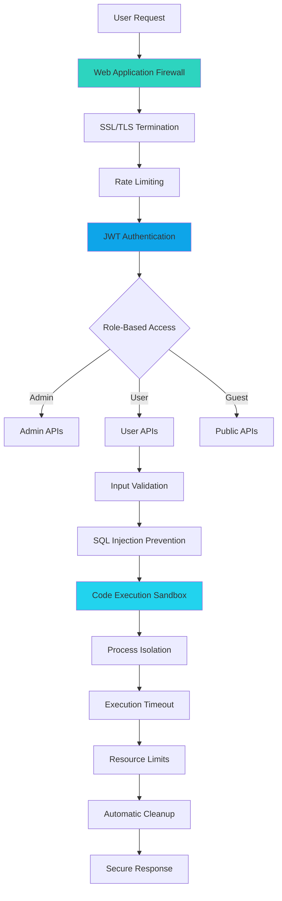

---

## Diagram 13: Language Support Matrix

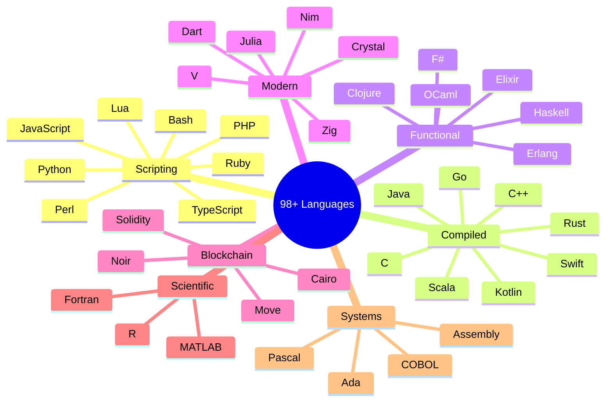

---

## Diagram 14: Production Deployment

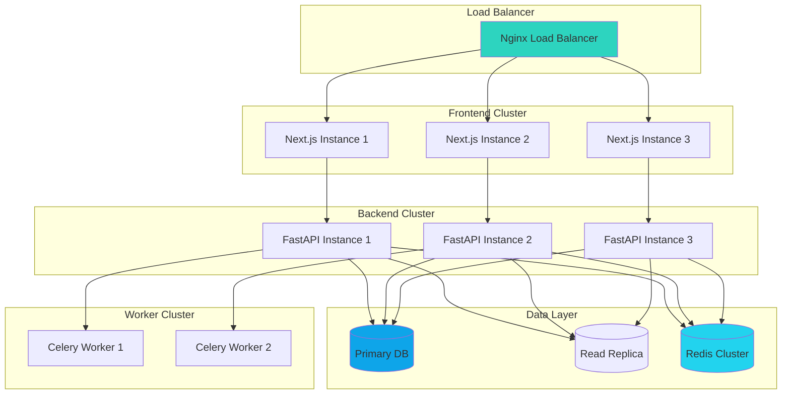

---

## Export Instructions

### Method 1: Mermaid CLI (Recommended for High Quality)
```bash
# Install mermaid-cli
npm install -g @mermaid-js/mermaid-cli

# Export to PNG (high resolution)
mmdc -i diagram.mmd -o diagram.png -w 2400 -H 1800 -b transparent

# Export to SVG (vector, best for papers)
mmdc -i diagram.mmd -o diagram.svg -b transparent

# Export to PDF
mmdc -i diagram.mmd -o diagram.pdf
```

### Method 2: Online Tools
- **Mermaid Live Editor:** https://mermaid.live/
  - Paste diagram code
  - Export as PNG/SVG/PDF
  - Adjust theme and scale

- **Draw.io with Mermaid:** https://app.diagrams.net/
  - Import mermaid code
  - Export in various formats

### Method 3: VS Code Extension
- Install "Markdown Preview Mermaid Support"
- Preview in VS Code
- Right-click to export

---

## Recommended Settings for Research Paper

### For IEEE/ACM Papers:
- **Format:** PNG or PDF (vector)
- **Resolution:** 300 DPI minimum
- **Width:** 3.5 inches (single column) or 7 inches (double column)
- **Color:** Use color sparingly, ensure grayscale readability
- **Fonts:** Embed all fonts

### Export Command for Paper Quality:
```bash
mmdc -i diagram.mmd -o diagram.pdf -t neutral -b white -w 3500 -H 2625
```

This creates 300 DPI images at 7 inches wide (suitable for double-column papers).

---

**Total Diagrams:** 14  
**Ready for Export:** ✅ All diagrams  
**Theme:** Engunity (Cyber Teal/Sky/Cyan)  
**Status:** Production Ready
