# Visual Assets for Research Paper - Engunity Code Lab

**Generated:** 2026-02-04  
**Purpose:** Complete collection of images, mermaid diagrams, and architecture visuals for research paper

---

## Table of Contents
1. [Existing Images](#existing-images)
2. [Existing Mermaid Diagrams](#existing-mermaid-diagrams)
3. [New Code Lab Diagrams](#new-code-lab-diagrams)
4. [System Architecture](#system-architecture)
5. [Data Flow Diagrams](#data-flow-diagrams)
6. [Component Hierarchies](#component-hierarchies)
7. [API Documentation](#api-documentation)

---

## 1. Existing Images

### Project Screenshots (frontend/public/)

1. **HERO.jpeg** (72 KB)
   - Main landing page hero image
   - Shows overall platform interface

2. **Hero1.jpeg** (103 KB)
   - Alternative hero image
   - Platform overview

3. **AICODEANDCHAT.jpeg** (99 KB)
   - AI Code and Chat feature showcase
   - Demonstrates dual functionality

4. **ClincialCodeAsistant.jpeg** (60 KB)
   - Clinical code assistant feature
   - Healthcare AI integration

5. **DocumentRAG.jpeg** (96 KB)
   - Document RAG system visualization
   - Shows document processing pipeline

6. **BENTO.jpeg** (68 KB)
   - Bento grid layout showcase
   - Feature matrix display

7. **Logo1.jpg** (42 KB)
   - Official Engunity logo
   - Branding asset

**Location:** `/home/agentrogue/Engunity/frontend/public/`

---

## 2. Existing Mermaid Diagrams

### 2.1 RAG Architecture (from rag_research.md)

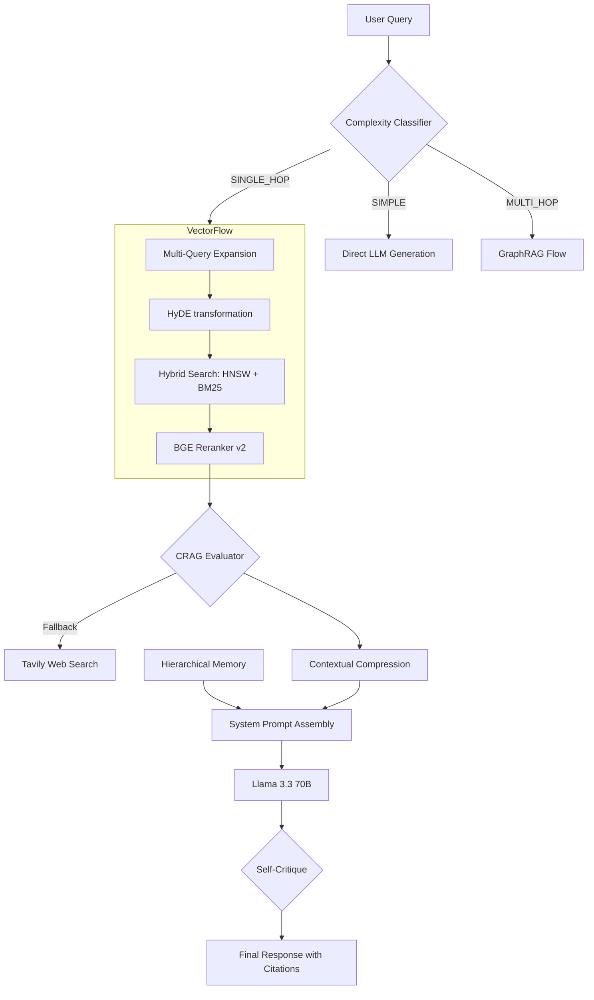

**Description:** Advanced RAG system with adaptive routing, hybrid search, and self-correction

---

### 2.2 Chat Implementation (from chat_implementation.md)

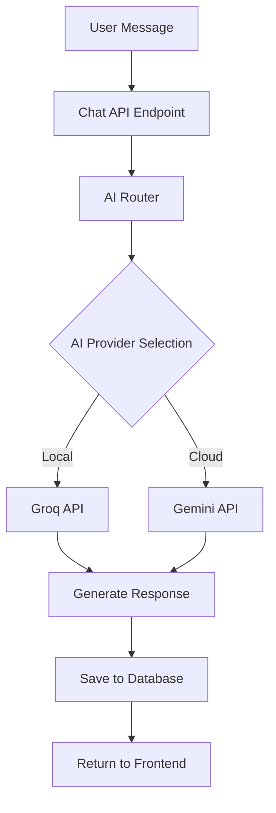

**Description:** Chat message flow with AI provider routing

---

## 3. New Code Lab Diagrams

### 3.1 Code Lab System Architecture

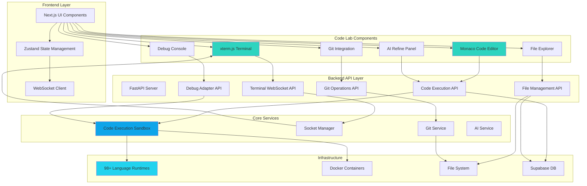

**Description:** Complete Code Lab system architecture showing all layers and integrations

---

### 3.2 Code Execution Flow

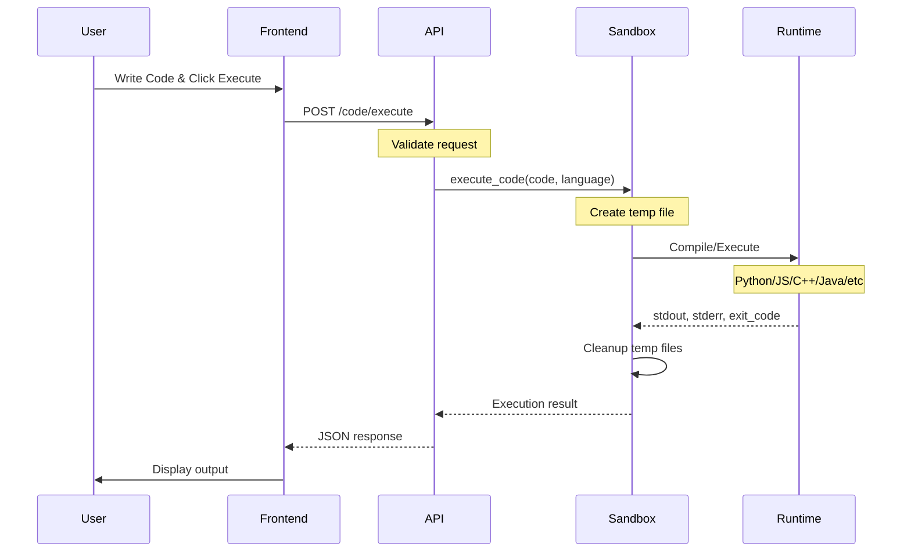

**Description:** Step-by-step code execution process with sandbox isolation

---

### 3.3 Terminal WebSocket Flow

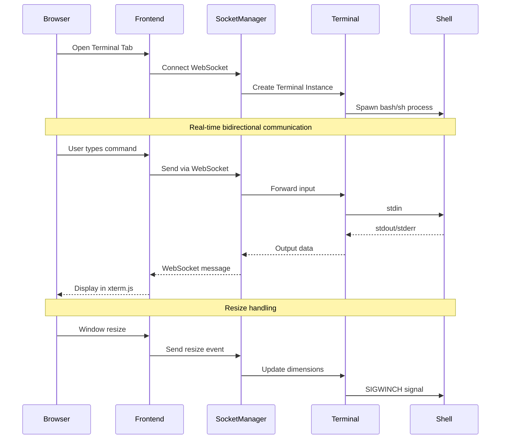

**Description:** Real-time terminal communication via WebSocket

---

### 3.4 Git Integration Workflow

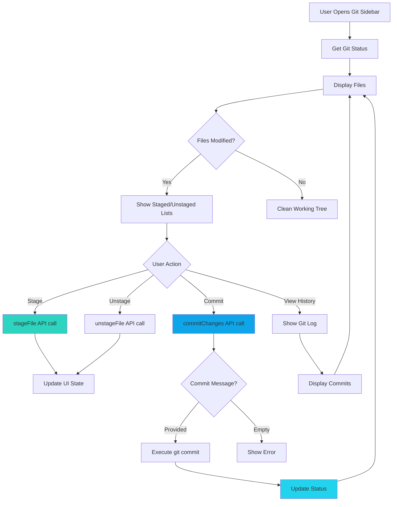

**Description:** Git operations workflow with stage/unstage/commit

---

### 3.5 AI Code Assistance Flow

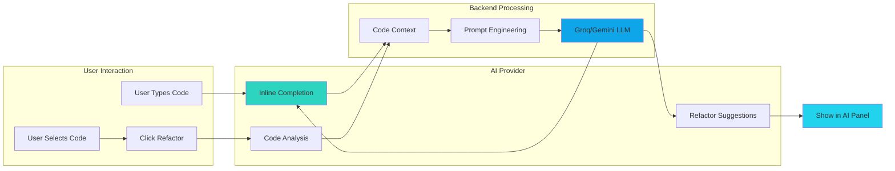

**Description:** AI-powered code completion and refactoring

---

### 3.6 Debug Session Flow

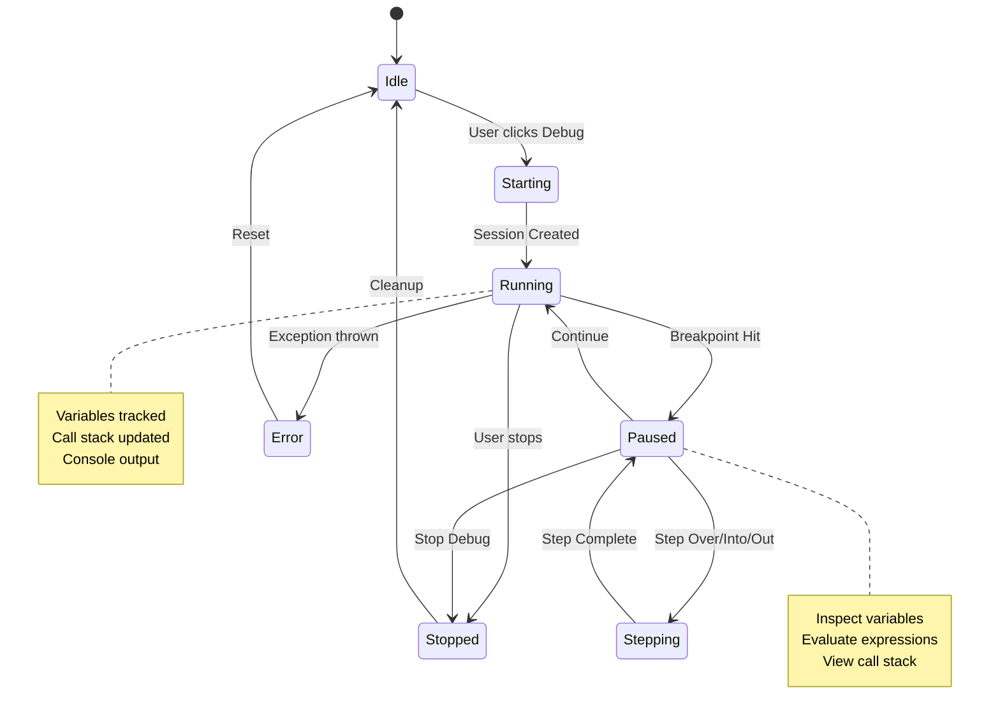

**Description:** Debug session state machine

---

## 4. System Architecture Diagrams

### 4.1 Full Stack Architecture

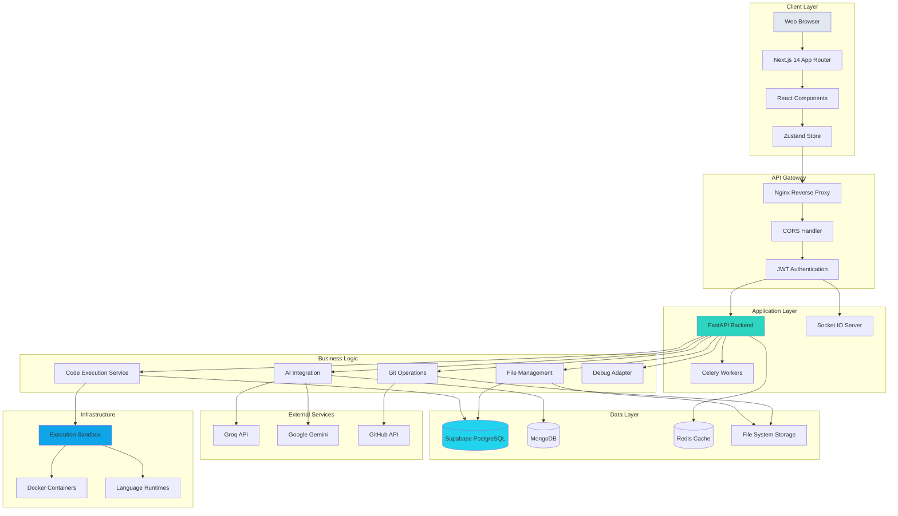

**Description:** Complete full-stack architecture from browser to infrastructure

---

### 4.2 Microservices Architecture

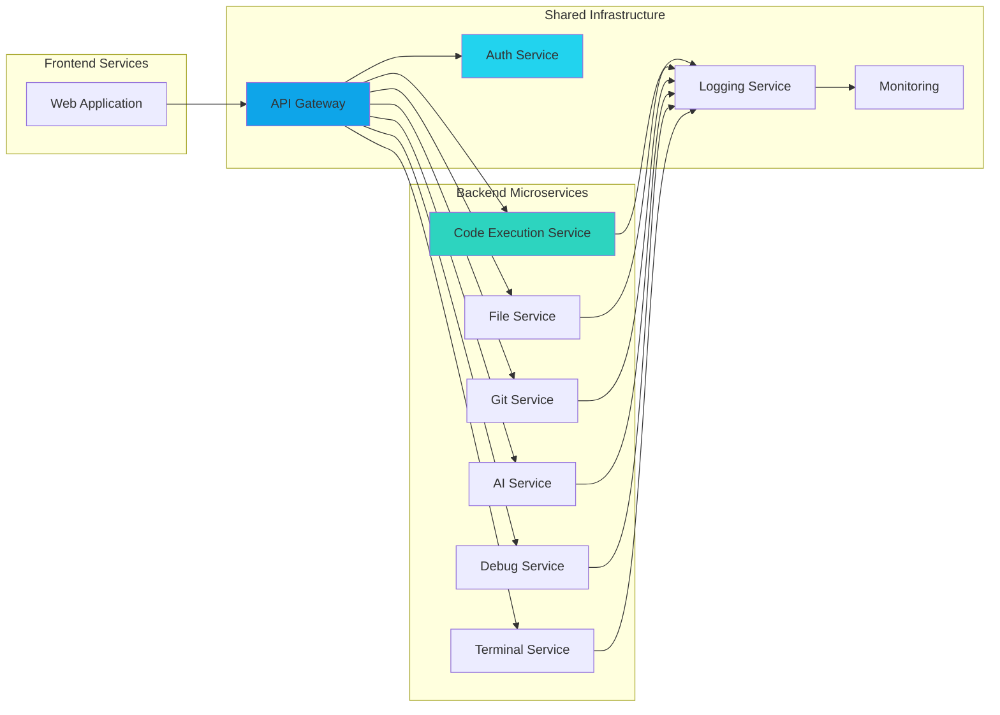

**Description:** Microservices architecture with shared infrastructure

---

## 5. Data Flow Diagrams

### 5.1 Data Flow - Code Execution

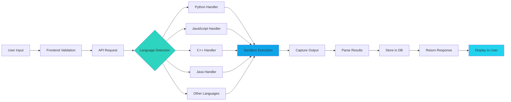

**Description:** Complete data flow for code execution

---

### 5.2 Data Flow - File Operations

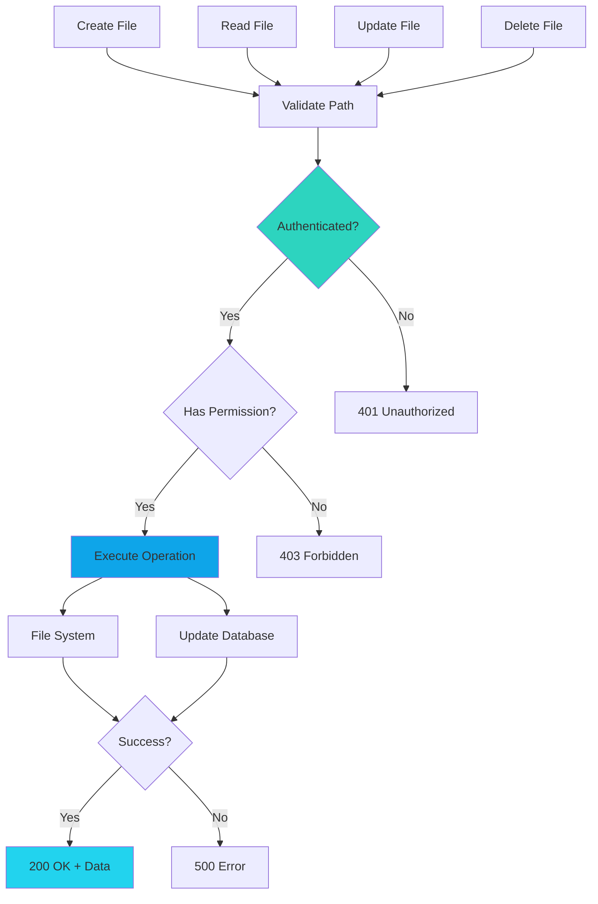

**Description:** File operations with authentication and authorization

---

### 5.3 Data Flow - Real-time Terminal

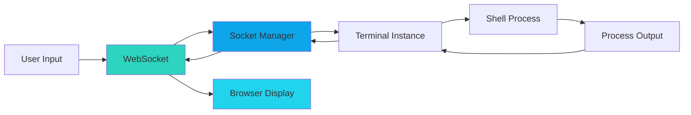

**Description:** Real-time bidirectional terminal communication

---

## 6. Component Hierarchies

### 6.1 Frontend Component Tree

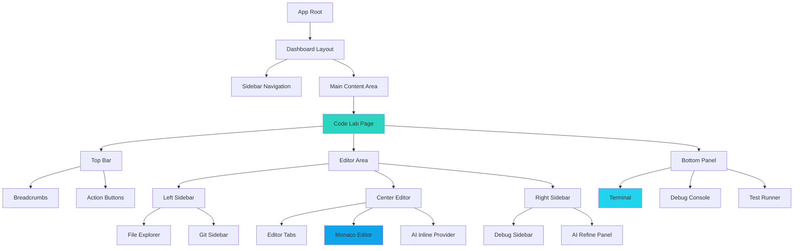

**Description:** Complete frontend component hierarchy

---

### 6.2 Backend Service Structure

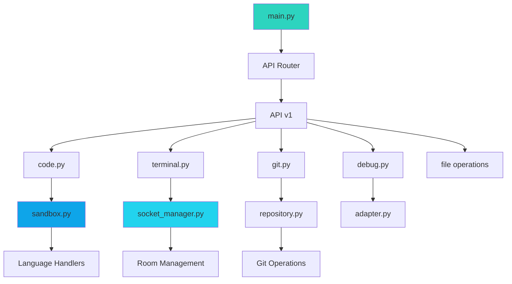

**Description:** Backend service architecture and dependencies

---

## 7. API Documentation Diagrams

### 7.1 API Endpoints Map

```mermaid
mindmap
  root((Code Lab API))
    Code Execution
      POST /execute
      POST /ai/complete
      POST /ai/refactor
      POST /ai/analyze
    File Management
      GET /files
      POST /files
      GET /files/{id}
      PATCH /files/{id}
      DELETE /files/{id}
    Git Operations
      GET /git/status
      POST /git/commit
      GET /git/branches
      GET /git/log
      POST /git/stage
      POST /git/unstage
    Terminal
      WebSocket /terminal
      POST /terminal/execute
    Debug
      POST /debug/start
      POST /debug/stop
      POST /debug/breakpoint
      POST /debug/continue
      POST /debug/step
      GET /debug/variables
```

**Description:** Complete API endpoint structure

---

### 7.2 Request/Response Flow

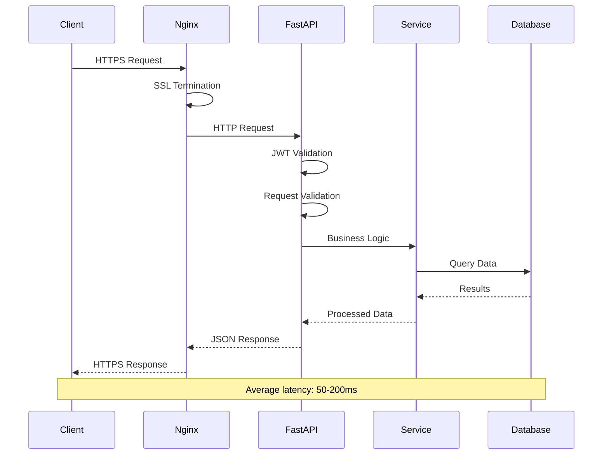

**Description:** Complete request/response cycle with timing

---

## 8. Deployment Architecture

### 8.1 Production Deployment

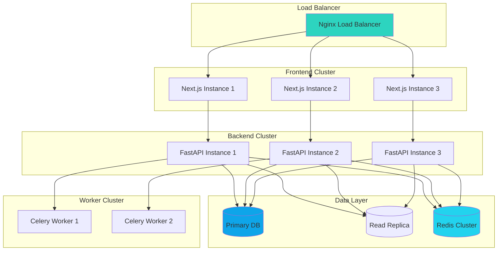

**Description:** Production deployment with high availability

---

### 8.2 Docker Container Architecture

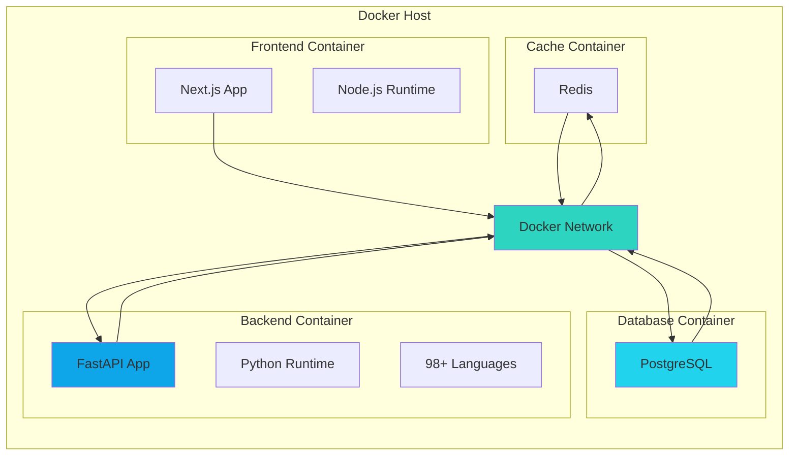

**Description:** Docker containerization architecture

---

## 9. Security Architecture

### 9.1 Security Layers

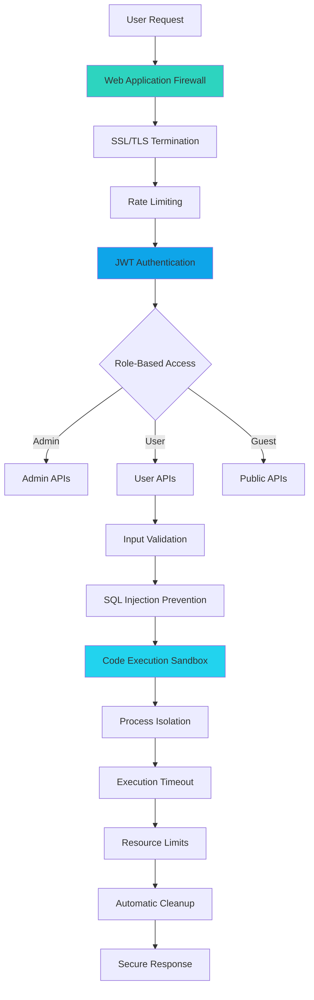

**Description:** Multi-layer security architecture

---

## 10. Performance Monitoring

### 10.1 Monitoring Architecture

```mermaid
graph LR
    subgraph "Application"
        App[Application Code]
        Metrics[Metrics Collection]
    end
    
    subgraph "Monitoring Stack"
        Prometheus[Prometheus]
        Grafana[Grafana Dashboard]
        AlertManager[Alert Manager]
    end
    
    subgraph "Logging"
        AppLogs[Application Logs]
        LogAggregator[Log Aggregator]
        LogStorage[Log Storage]
    end
    
    App --> Metrics
    Metrics --> Prometheus
    Prometheus --> Grafana
    Prometheus --> AlertManager
    
    App --> AppLogs
    AppLogs --> LogAggregator
    LogAggregator --> LogStorage
    
    AlertManager --> Notification[Slack/Email]
    
    style Prometheus fill:#2DD4BF
    style Grafana fill:#0EA5E9
    style LogStorage fill:#22D3EE
```

**Description:** Comprehensive monitoring and alerting system

---

## 11. Language Support Matrix

### 11.1 Supported Languages Visual

```mermaid
mindmap
  root((98+ Languages))
    Scripting
      Python
      JavaScript
      TypeScript
      Ruby
      PHP
      Perl
      Lua
      Bash
    Compiled
      C
      C++
      Java
      Rust
      Go
      Swift
      Kotlin
      Scala
    Functional
      Haskell
      Elixir
      Erlang
      Clojure
      OCaml
      F#
    Modern
      Dart
      Julia
      Zig
      Nim
      Crystal
      V
    Blockchain
      Solidity
      Move
      Cairo
      Noir
    Scientific
      R
      MATLAB
      Fortran
    Systems
      Assembly
      COBOL
      Ada
      Pascal
```

**Description:** Complete language support matrix

---

## Summary

### Asset Inventory

| Category | Count | Description |
|----------|-------|-------------|
| **Existing Images** | 7 | Screenshots and branding |
| **Existing Mermaid Diagrams** | 2 | RAG and Chat architecture |
| **New System Diagrams** | 11 | Complete architecture coverage |
| **Data Flow Diagrams** | 3 | Process flows |
| **Component Hierarchies** | 2 | Frontend and backend structure |
| **API Diagrams** | 2 | Endpoint maps and flows |
| **Deployment Diagrams** | 2 | Production and Docker |
| **Security Diagrams** | 1 | Security layers |
| **Monitoring Diagrams** | 1 | Observability stack |
| **Language Matrix** | 1 | Language support |

**Total Visual Assets:** 32+ diagrams and images

---

## Usage Instructions

### For LaTeX/IEEE Papers
1. Export mermaid diagrams to PNG/PDF using mermaid-cli or online tools
2. Use existing JPEG images from frontend/public/
3. Reference diagrams in paper with proper captions

### For Markdown/HTML
1. Copy mermaid code blocks directly into markdown
2. Use GitHub or GitLab rendering for automatic visualization
3. Embed images using relative paths

### For Presentations
1. Export high-resolution diagrams
2. Use consistent color scheme (Engunity theme)
3. Maintain aspect ratios for clarity

---

**Document Status:** Complete  
**Last Updated:** 2026-02-04  
**Assets Location:** Multiple (documented above)  
**Ready for:** Research Paper, Presentations, Documentation
