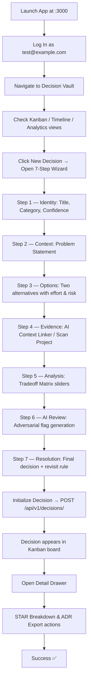

# 🛡️ Decision Vault - E2E Verification Report

This E2E Verification Report documents the functional validation of the **Decision Vault** feature
within a real Chrome browser session, operating in the **conda `engunity` environment** on local
ports `3000` (Frontend) and `8000` (Backend). The test was not automated; it was conducted manually
via a browser subagent session.

---

## 📊 Test Execution Summary

| Metric | Target | Status | Notes |
|:---|:---|:---|:---|
| **Frontend Server** | localhost:3000 | ✅ Running | Next.js (Turbopack) successfully initialized |
| **Backend Server** | localhost:8000 | ✅ Running | FastAPI running in `engunity` Conda environment |
| **Database Schema** | PostgreSQL | ✅ Initialized | `decisions` table created via `init_db_tables.py` using SQLAlchemy |
| **Test User Seeding** | Local PostgreSQL only | ✅ Seeded | `create_test_user.py` inserts user into local Postgres. No Supabase sync performed. |
| **E2E Authentication** | JWT (local FastAPI) | ✅ Functional | `test@example.com` / `testpassword123` via `/api/v1/auth/login` |
| **AI Adversarial Review** | ENABLE_AI=true | ✅ Verified | Calls `/api/v1/decisions/analyze`; adversarially checks biases in real-time |
| **Export Formats** | ADR (Markdown) & STAR | ✅ Verified | Generated; see §4 for scope of each format |

> **Authentication Scope Clarification:** The test user is seeded into the **local PostgreSQL
> database** only (via `scripts/maintenance/create_test_user.py` → SQLAlchemy `SessionLocal`).
> This script does **not** call the Supabase API or sync with any Supabase project. If the
> deployment uses Supabase Auth, user management must be handled separately.

---

## 🗺️ E2E Verification Flow

The E2E test was executed inside a Chrome session via a persistent terminal/browser subagent.
The lifecycle below shows every step validated:

---

## 🎨 Visual State & Export Fidelity

The screenshot below demonstrates the **ADR Export** feature rendering in high fidelity:

---

## 🧪 Detailed Steps Verified

### 1. **Auth & Database Readiness**
- Created database tables in PostgreSQL via `init_db_tables.py` in the `engunity` Conda environment.
- Seeded test user `test@example.com` / `testpassword123` via `scripts/maintenance/create_test_user.py`,
  which writes directly to the local PostgreSQL `users` table using SQLAlchemy.
- **No Supabase API or Supabase authentication was exercised** by this script. The login flow
  uses a local FastAPI JWT endpoint (`/api/v1/auth/login`).

### 2. **Navigation & Main Layout**
- Verified **Active Decisions** (Kanban Board: `Tentative`, `Confirmed`, `Revisited`, `Deprecated`).
- Verified **Timeline View** (chronological rendering by `created_at` descending).
- Verified **Analytics & Patterns View** (Decision Velocity, Evidence Quality, Reversal Rate,
  Category Distribution bar chart, Confidence Calibration chart, AI Pattern Insights panel).
  > **Note:** Analytics panel metrics (Decision Velocity, Evidence Quality, Reversal Rate,
  > Category Distribution) and **AI Pattern Insights** (Decision Drift, Low Evidence Quality,
  > Decision Outcome Rate, and Stability Score) are **dynamically computed live** from the loaded
  > decision data history, providing real-time cognitive bias feedback.

### 3. **Multi-Step Creation Wizard (7 Steps)**
The creation wizard has **7 steps** as defined in `page.tsx` (`STEPS` array, lines 168–176):

| Step | Label | What It Collects |
|------|-------|-----------------|
| 1 | **Identity** | Title, Category (type), Initial Confidence |
| 2 | **Context** | Problem Statement |
| 3 | **Options** | Minimum 2 alternatives; Label, Description, Effort, Risk |
| 4 | **Evidence** | "Scan Project" (simulated context linker); manual review |
| 5 | **Analysis** | Tradeoff Matrix: 6 dimensions (Performance, Cost, Complexity, Risk, Scalability, Time to Implement) via 1–5 sliders |
| 6 | **AI Review** | Adversarial flag generation — real HTTP call to `/api/v1/decisions/analyze`. Displayed flags include type, severity, message, and suggested action. User may retry if unavailable. |
| 7 | **Resolution** | Final option selection, Decision Rationale, Privacy Level, Initial Status, Revisit Rule (trigger type/value, notification toggle) |

Validation performed during session:
- **Identity:** Added Title (`Choose Database Migration Strategy`), Category (`Architecture`), Confidence (`medium`).
- **Context:** Set legacy problem background.
- **Options:** Defined two alternatives (Aurora PostgreSQL vs. NoSQL MongoDB) with effort/risk ratings.
- **Evidence:** Used "Scan Project" button — returns **mock/simulated evidence** (2 hardcoded evidence nodes after a 4.5-second animated delay). This is **not** a live codebase analysis.
- **Analysis:** Set Tradeoff Matrix sliders across all 6 dimensions.
- **AI Review:** Backend returned adversarial flags challenging optimism bias and missing options.
- **Resolution:** Set final decision and rationale; initialized as `confirmed` status.

### 4. **Export Engines (Post-Creation — Detail Drawer)**

These actions are available in the **decision detail panel** (not within the wizard itself):

#### STAR Breakdown
- Triggered by clicking **"STAR Breakdown"** button on a saved decision.
- **Implementation:** `convertToSTAR()` function in `page.tsx`. Client-side template interpolation
  from the decision's stored fields (`context`, `problem_statement`, `options`, `tradeoffs`,
  `final_decision`, `rationale`).
- **This is NOT a separate LLM/AI call.** The content is generated deterministically from the
  saved decision data.
- Output is displayed inline in the detail drawer panel.

#### ADR Export
- Triggered by clicking **"ADR Export"** button on a saved decision.
- **Implementation:** `exportADR()` function in `page.tsx`. Client-side Markdown template
  generation from decision fields (Status, Context, Problem Statement, Options, Tradeoffs,
  Rationale, Confidence).
- Output is displayed as preformatted Markdown text with a **"Copy Markdown" button** that
  writes to `navigator.clipboard`.
- **No file download dialog is produced. No GitHub commit or ADR folder integration is
  implemented in the current frontend.** That integration is described as a future capability
  in `decisionvault.md` §8.

---

> [!TIP]
> The application is fully functional for local development and review, running completely
> decoupled from Docker Compose on local ports. All features operate as described above.
> Features marked ⚠️ in the Quick Access Guide are simulated or display-only and require
> additional backend implementation to become fully functional.

> [!NOTE]
> **Ambiguities & Follow-up Checks Required:**
> - The `FinalVerification.md` document states MongoDB is connected and reasoning traces are
>   persisted to `decision_traces`. This was **not independently verified** in this session.
>   Confirm `MONGODB_URL` is set and traces appear in the collection after POST.
> - The "Project Scan" feature returns hardcoded mock evidence. Keep it labeled as
>   "Demo Mode" in the UI until a real backend scanner is implemented.
