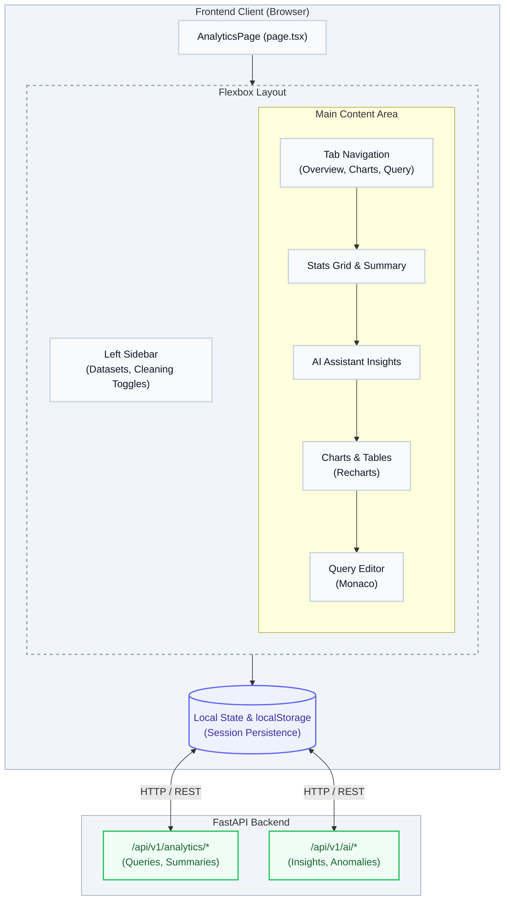
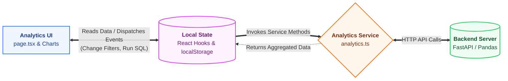

# Analytics Studio — Architecture & Developer Documentation

> **Route:** `/analytics`  
> **Files:** `page.tsx` · `analytics.module.css`  
> **Agent:** documentation-expert  
> **Audience:** Frontend developers, data engineers, contributors

---

## Table of Contents

1. [Overview](#1-overview)
2. [Directory Structure](#2-directory-structure)
3. [High-Level Architecture Diagram](#3-high-level-architecture-diagram)
4. [Layout System](#4-layout-system)
5. [State Management](#5-state-management)
6. [Service Layer](#6-service-layer)
7. [Component Reference](#7-component-reference)
8. [Key Flows](#8-key-flows)
9. [Backend API Endpoints](#9-backend-api-endpoints)
10. [CSS Design Tokens](#10-css-design-tokens)
11. [Data Flow Diagram](#11-data-flow-diagram)

---

## 1. Overview

**Analytics Studio** (`/analytics`) is an advanced, browser-based data analysis and visualization dashboard within EngUnityCore. It empowers users to upload datasets, run SQL queries, generate charts, clean data, and receive AI-driven insights directly in the browser.

| Feature | Implementation |
|---|---|
| Query Editor | Monaco Editor (dynamically imported, SSR-disabled) |
| Visualizations | Recharts (`BarChart`, `LineChart`, `PieChart`, etc.) |
| AI Integration | AI Assistant for anomaly detection & insights |
| Layout | Responsive Flexbox layout (`.mainContainer`) |
| Data Persistence | `localStorage` session caching & `analysisSessionService` |
| Theming | Clean Light Theme scoped via `analytics.module.css` |

---

## 2. Directory Structure

```
frontend/src/app/(dashboard)/analytics/
├── page.tsx                  ← Root Analytics application
├── analytics.module.css      ← Scoped CSS module (Clean Light Theme)
├── [datasetId]/              ← Dynamic route for specific datasets
├── export-preview/           ← Data export configuration page
└── upload/                   ← File upload handling

frontend/src/components/analytics/
├── WellbeingBanner.tsx       ← Banner component
└── ...                       ← Other internal analytics components

frontend/src/components/charts/
├── DataAnalysisChat.tsx      ← AI Chat interface for data
├── Histogram.tsx             ← Recharts wrapper
├── BoxPlot.tsx               ← Recharts wrapper
└── Heatmap.tsx               ← Recharts wrapper

frontend/src/services/
└── analytics.ts              ← REST client for analytics & ML APIs
```

---

## 3. High-Level Architecture Diagram



---

## 4. Layout System

The `AnalyticsPage` relies on standard React components utilizing a responsive Flexbox layout via `analytics.module.css`.

### Main Containers

| Component | Class | Description |
|---|---|---|
| Top Navigation | `.topNav` | Sticky header with actions and model selection. |
| Main Container | `.mainContainer` | `display: flex; min-height: calc(100vh - 120px);` |
| Left Sidebar | `.leftSidebar` | Fixed 20rem width, scrollable, holds Dataset Cards. |
| Main Content | `.mainContent` | `flex: 1`, padded area for actual data and charts. |

### Responsive Design

- Below `1280px`: Stats grid shrinks from 4 columns to 2 columns.
- Below `768px`: The `mainContainer` drops flex direction to `column`. Sidebar takes 100% width and acts as a top section, and the Top Navigation right-side items are hidden.

---

## 5. State Management

Unlike CodeLab which uses Zustand heavily, Analytics relies extensively on complex **React Local State (`useState`)** and **`localStorage`** for session caching.

### Key State Branches

```ts
// Session & File Management
const [currentFileId, setCurrentFileId] = useState<string | null>(null);
const [currentSessionId, setCurrentSessionId] = useState<string | null>(/* loaded from localStorage */);
const [isSessionLoaded, setIsSessionLoaded] = useState(false);

// Data Context
const [dataPreview, setDataPreview] = useState<DataPreview | null>(null);
const [columnMetadata, setColumnMetadata] = useState<ColumnMetadata[]>([]);
const [dataSummary, setDataSummary] = useState<DataSummary | null>(null);

// Machine Learning & AI
const [aiInsights, setAiInsights] = useState<AIInsight[]>([]);
const [anomalyAlerts, setAnomalyAlerts] = useState<AnomalyAlert[]>([]);
const [predictionResults, setPredictionResults] = useState<PredictionResult | null>(null);

// Query Execution
const [sqlQuery, setSqlQuery] = useState('SELECT * FROM dataset LIMIT 10;');
const [queryResults, setQueryResults] = useState<QueryResult | null>(null);
```

### Persistence Logic

The component features a robust `useEffect` block upon mounting that checks `localStorage` for `analysisData`. If available, it skips fetching from the backend and immediately restores the session to prevent race conditions and improve load times.

---

## 6. Service Layer

**File:** `src/services/analytics.ts` and `src/lib/services/analysis-service.ts`

### Typical API Interactions

| Operation | Implementation Focus |
|---|---|
| Fetch Datasets | Retrieves user-uploaded CSVs / tabular files. |
| SQL Queries | Sends raw SQL strings to the backend engine to query the dataset. |
| AI Generation | Asks LLM models (e.g., GPT-OSS-120B) for column insights or data summaries. |
| Session Sync | Synchronizes local `analysisData` state with the backend Database. |

---

## 7. Component Reference

### `AnalyticsPage` (Root)
The monolithic orchestrator handling state restoration, hotkeys (`Ctrl+Enter`, `Ctrl+E`), dynamic query template generation based on column metadata, and UI layout.

### `Editor` (Monaco)
Dynamically imported without SSR (`ssr: false`) to serve as the SQL Query editor.

### `DataAnalysisChat`
Right-hand or inline AI chat integration tailored to answer specific queries about the current `columnMetadata` and `dataPreview`.

### Charting (`Recharts`)
Renders `.chartCard` containers wrapping `<ResponsiveContainer>` from `recharts`. Supported variants:
- Bar, Line, Pie, Area, Scatter
- Custom implementations for BoxPlot, Heatmap, and Histogram.

---

## 8. Key Flows

### 8.1 Session Initialization

```
Component Mounts
  └─ useEffect checks `currentSessionId`
       ├─ Found in localStorage
       │    ├─ Parse JSON `analysisData`
       │    ├─ Restore `dataPreview`, `columnMetadata`, `chartsData`
       │    └─ Mark `isSessionLoaded` = true
       └─ Not found (or fallback)
            └─ Fetch fresh data from backend / trigger Demo Dataset
```

### 8.2 Query Execution Flow

```
User writes SQL -> Hits Ctrl+Enter
  └─ handleRunQuery()
       ├─ Validate SQL format
       ├─ Call analyticsService.executeQuery(sql)
       ├─ Wait for Backend processing
       ├─ Return `QueryResult`
       └─ Update UI table and visualizes response
```

---

## 9. Backend API Endpoints

*(Note: Assumed based on general service contracts for the module)*

### Data Retrieval & Queries
```
POST /api/v1/analytics/query
Body: { sql: string, datasetId: string }
Response: { columns: [...], rows: [...], executionTime: number }

GET /api/v1/analytics/datasets/{id}/summary
Response: { rowCount, columnCount, missingValues, ... }
```

### AI Integration
```
POST /api/v1/ai/insights
Body: { datasetSchema: [...], sampleRows: [...] }
Response: { anomalies: [...], recommendations: [...] }
```

---

## 10. CSS Design Tokens

The module uses `.analytics-theme` scoped strictly inside `analytics.module.css`.

### Key Colors

| Token | Value | Element |
|---|---|---|
| App Background | `#f9fafb` | Body / Root |
| Surface | `#ffffff` | Cards, Sidebars, Nav |
| Primary Blue | `#2563eb` | Active tabs, Action Buttons, AI Icons |
| Text Primary | `#1f2937` | Titles, Main Content |
| Text Muted | `#6b7280` | Labels, Table Headers |
| Border Standard | `#e5e7eb` | Dividers, Borders |
| Success Green | `#16a34a` | Success states, Positive values |
| Danger Red | `#ef4444` | Errors, Delete Actions |

---

## 11. Data Flow Diagram



---

*Generated by documentation-expert agent · EngUnityCore*
