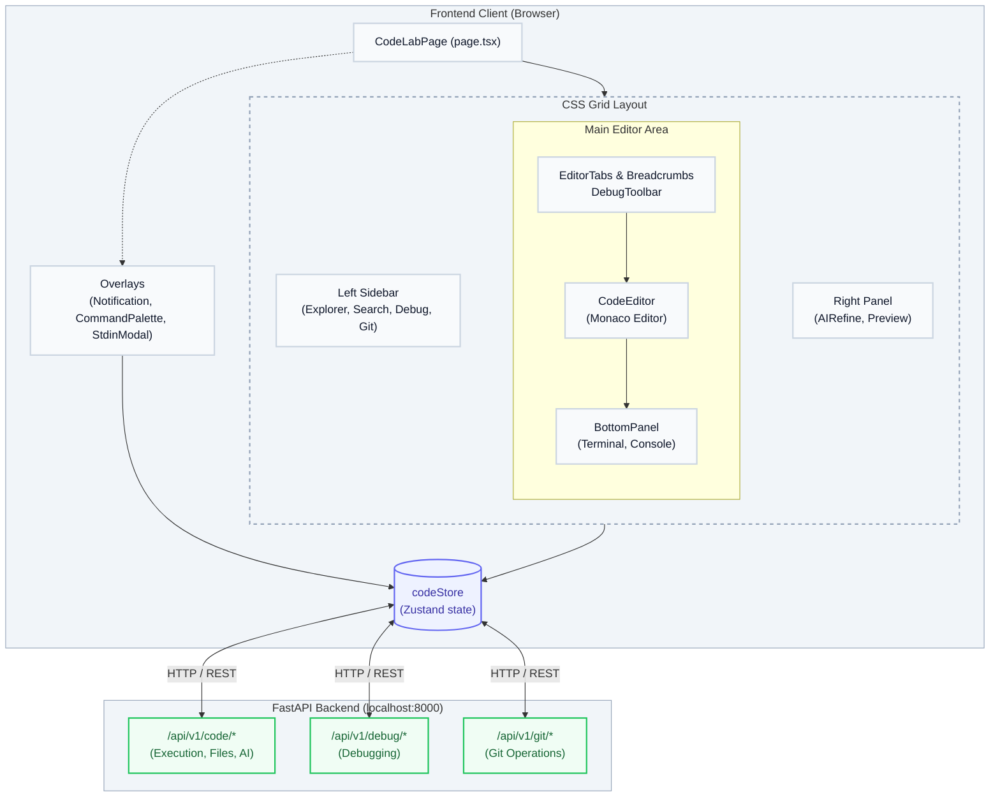
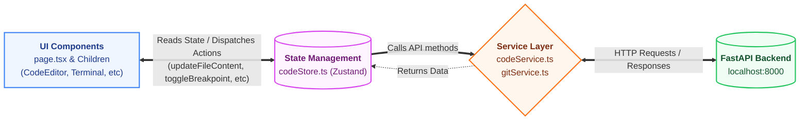

# Code Studio — Architecture & Developer Documentation

> **Route:** `/code`  
> **Files:** `page.tsx` · `codelab.module.css`  
> **Agent:** documentation-expert  
> **Audience:** Frontend developers, contributors

---

## Table of Contents

1. [Overview](#1-overview)
2. [Directory Structure](#2-directory-structure)
3. [High-Level Architecture Diagram](#3-high-level-architecture-diagram)
4. [Layout System](#4-layout-system)
5. [State Management — `codeStore`](#5-state-management--codestore)
6. [Service Layer — `codeService`](#6-service-layer--codeservice)
7. [Component Reference](#7-component-reference)
8. [Key Flows](#8-key-flows)
9. [Keyboard Shortcuts](#9-keyboard-shortcuts)
10. [Backend API Endpoints](#10-backend-api-endpoints)
11. [CSS Design Tokens](#11-css-design-tokens)
12. [Data Flow Diagram](#12-data-flow-diagram)

---

## 1. Overview

**Code Studio** (`/code`) is a full browser-based IDE built inside the EngUnityCore dashboard. It replicates core functionality of desktop editors (VS Code style) directly in the browser:

| Feature | Implementation |
|---|---|
| Code editing | Monaco Editor (dynamically imported, SSR-disabled) |
| Multi-language execution | HTTP POST to FastAPI `/api/v1/code/execute-direct` |
| File system | Zustand store (`codeStore`) + backend REST API |
| Debugging | FastAPI debug session API (`/api/v1/debug/*`) |
| AI code assistance | FastAPI `/api/v1/code/ai-assist` + `/api/v1/code/ai-chat` |
| Git integration | `gitService` wrapping `/api/v1/git/*` |
| Terminal | XTerm.js via `Terminal` / `TerminalInstance` components |
| Real-time layout | CSS Grid with dynamic column widths via inline `style` |

---

## 2. Directory Structure

```
frontend/src/app/(dashboard)/code/
├── page.tsx                  ← Root page component (CodeLabPage)
└── codelab.module.css        ← Scoped CSS module (light theme)

frontend/src/components/code-lab/
├── AIInlineProvider.tsx      ← Monaco inline completion provider
├── AIRefinePanel.tsx         ← Right-panel AI chat & refine
├── BottomPanel.tsx           ← Resizable bottom panel (terminal/console/errors/tasks)
├── Breadcrumbs.tsx           ← File path breadcrumb trail
├── CodeEditor.tsx            ← Monaco Editor wrapper
├── CommandPalette.tsx        ← Ctrl+P command palette overlay
├── DebugConsole.tsx          ← Debug console output
├── DebugSidebar.tsx          ← Debug variables, call stack
├── DebugToolbar.tsx          ← Step/Continue/Stop controls
├── EditorTabs.tsx            ← Open file tabs row
├── FileExplorer.tsx          ← Sidebar file tree (drag & drop)
├── FindReplace.tsx           ← Find & replace hook for Monaco
├── GitSidebar.tsx            ← Git status, staging, commit
├── GlobalSearch.tsx          ← Full-text search sidebar
├── NotificationOverlay.tsx   ← Toast notifications
├── PreviewPanel.tsx          ← Right-panel live preview (iframe)
├── StatusBar.tsx             ← Bottom status bar (line/col, language)
├── TeamChat.tsx              ← Collaborative team chat sidebar
├── Terminal.tsx              ← Terminal session manager
└── TerminalInstance.tsx      ← XTerm.js terminal instance

frontend/src/stores/
└── codeStore.ts              ← Zustand global state for Code Studio

frontend/src/services/
├── code.ts                   ← REST client for project/file CRUD + AI
└── git.ts                    ← REST client for Git operations
```

---

## 3. High-Level Architecture Diagram



---

## 4. Layout System

`CodeLabPage` renders a **CSS Grid** container (`styles.grid`) with dynamic column widths set via an inline `style` prop:

```tsx
<div
  className={styles.grid}
  style={{
    gridTemplateColumns: `${isSidebarOpen ? '280px' : '0px'} 1fr ${isAIRefineOpen ? '380px' : '48px'}`,
  }}
>
```

### Grid Rows

```
gridTemplateRows: 48px 1fr 28px
```

| Row | Height | Element |
|---|---|---|
| Row 1 | `48px` | Header toolbar (`styles.header`, `grid-column: 1 / -1`) |
| Row 2 | `1fr` | Three-column layout (sidebar + editor + right panel) |
| Row 3 | `28px` | Status bar (`styles.statusbar`, `grid-column: 1 / -1`) |

### Column Zones

| Column | Default Width | Controlled by |
|---|---|---|
| Left sidebar | `280px` / `0px` | `isSidebarOpen` in `codeStore` |
| Main editor | `1fr` (flexible) | Always present |
| Right panel | `380px` / `48px` | `isAIRefineOpen` in `codeStore` |

---

## 5. State Management — `codeStore`

All IDE state lives in a single **Zustand** store at `src/stores/codeStore.ts`.

### State Shape

```ts
interface CodeState {
  // File System
  files: FileItem[];          // All files/folders in the virtual FS
  openFileIds: string[];      // IDs of tabs currently open
  activeFileId: string | null;

  // Terminal
  terminals: TerminalSession[];
  activeTerminalId: string | null;
  isTerminalOpen: boolean;
  terminalOutput: string | null;
  terminalOutputTimestamp: number;

  // Debug
  debugSession: DebugSession; // {id, status, currentLine, variables, callStack}
  breakpoints: Record<string, number[]>; // fileId -> line numbers[]

  // Git
  gitStatus: GitStatus | null;
  gitHistory: GitCommit[];
  stagedFiles: string[];
  isGitLoading: boolean;

  // UI State
  isAIRefineOpen: boolean;
  isSidebarOpen: boolean;
  isCommandPaletteOpen: boolean;
  activeSidebarTab: 'explorer'|'search'|'debug'|'git'|'test'|'team';
  activeRightTab: 'ai' | 'preview';
  activeBottomTab: 'terminal'|'console'|'errors'|'tasks'|'debug_console';
  cursorPosition: { ln: number; col: number };
  notification: { message: string; type: 'info'|'success'|'error' } | null;

  // Project
  currentProjectId: string | null;
}
```

### Key Data Type — `FileItem`

```ts
interface FileItem {
  id: string;
  name: string;
  type: 'file' | 'folder';
  content?: string;
  language?: string;    // auto-detected from extension
  parentId?: string;    // parent folder ID (undefined = root)
  isOpen?: boolean;     // folder expand state
  isDirty?: boolean;    // unsaved changes indicator
}
```

### Key Actions

| Action | Description |
|---|---|
| `openFile(id)` | Adds file to `openFileIds`, sets `activeFileId` |
| `closeFile(id)` | Removes from tabs, picks next active file |
| `updateFileContent(id, content)` | Sets `isDirty: true`, triggers auto-save timer |
| `saveFile(id)` | PATCH to backend, clears `isDirty` |
| `addFile(name, type)` | Optimistic local add, then POST to backend, swaps temp ID |
| `renameFile(id, name)` | Optimistic rename, then PATCH to backend |
| `moveFile(fileId, newParentId)` | Validates no circular moves, PATCH to backend |
| `startDebugSession(fileId)` | POST to `/api/v1/debug/start`, syncs breakpoints |
| `toggleBreakpoint(fileId, line)` | Toggles locally, syncs to active debug session |
| `stepOver()` | POST `/step`, fetches variables, updates `debugSession` |
| `continueDebug()` | POST `/continue`, updates `debugSession` |
| `commitChanges(projectId, msg)` | Commits staged files, refreshes git status |
| `appendTerminalOutput(output)` | Updates `terminalOutput` with timestamp trigger |
| `setNotification(...)` | Shows toast, auto-clears after timeout |
| `initProject()` | Loads files from backend on mount |

---

## 6. Service Layer — `codeService`

**File:** `src/services/code.ts`  
**Base URL:** `process.env.NEXT_PUBLIC_API_URL` || `http://localhost:8000/api/v1`

All methods attach a Bearer token from `authStore`.

### Project CRUD

| Method | HTTP | Endpoint |
|---|---|---|
| `getProjects()` | GET | `/code/` |
| `createProject(data)` | POST | `/code/` |
| `getProject(id)` | GET | `/code/{id}` |
| `updateProject(id, data)` | PATCH | `/code/{id}` |
| `deleteProject(id)` | DELETE | `/code/{id}` |
| `uploadFiles(projectId, file)` | POST (multipart) | `/code/{id}/upload` |

### File CRUD

| Method | HTTP | Endpoint |
|---|---|---|
| `getProjectFiles(projectId)` | GET | `/code/{id}/files` |
| `getFile(projectId, fileId)` | GET | `/code/{id}/files/{fid}` |
| `createFile(projectId, data)` | POST | `/code/{id}/files` |
| `updateFile(projectId, fileId, data)` | PATCH | `/code/{id}/files/{fid}` |
| `deleteFile(projectId, fileId)` | DELETE | `/code/{id}/files/{fid}` |

### AI Operations

| Method | HTTP | Endpoint |
|---|---|---|
| `analyzeCode(projectId, fileId?)` | POST | `/code/{id}/ai/analyze` |
| `getCodeSuggestions(...)` | POST | `/code/{id}/ai/suggest` |
| `searchCode(projectId, query)` | POST | `/code/{id}/search` |
| `refineCode(data)` | POST | `/code/refine` |

---

## 7. Component Reference

### `CodeEditor` — `components/code-lab/CodeEditor.tsx`

The Monaco Editor wrapper. Key behaviours:

- **Dynamic import** with `ssr: false` to avoid Node.js/DOM conflicts.
- **Custom theme** `engunity-light`: white background, blue keywords, green strings, amber numbers, purple types.
- **Auto-save**: 5-second debounce on `isDirty` change → calls `saveFile()`.
- **AI inline completions**: Registers `AIInlineCompletionProvider` for Python, JavaScript, TypeScript when `aiSuggestionsEnabled` is true.
- **ResizeObserver**: Manually calls `editor.layout()` when the container resizes, since `automaticLayout: false`.
- **Cursor tracking**: Updates `cursorPosition` in store on every cursor move → reflected in `StatusBar`.
- **Ctrl+S binding**: Wired inside Monaco's command system (separate from the global keyboard shortcut in `page.tsx`).

### `AIRefinePanel` — `components/code-lab/AIRefinePanel.tsx`

The right-panel AI assistant. Two call modes:

1. **Quick actions** (suggestion buttons): POST to `/api/v1/code/ai-assist` with `action` = `optimize | security | refactor | explain`
2. **Free chat**: POST to `/api/v1/code/ai-chat` with full conversation history (last 10 messages)
3. **Save to Vault**: Navigates to `/decisionvault` with pre-filled code context in query params.

When the AI returns `improved_code`, the user can type `"apply"` to patch the active file via `updateFileContent()`.

Renders responses as Markdown using `react-markdown` + `remark-gfm`.

### `BottomPanel` — `components/code-lab/BottomPanel.tsx`

A **resizable** bottom panel with drag handle. Height range: 120px–600px.

**Tabs:**

| Tab | Content |
|---|---|
| Terminal | XTerm.js terminal (`Terminal` component) |
| Debug Console | Scrollable debug output (`DebugConsole`) |
| Console | Static dev server log (placeholder) |
| Errors | Shows "No problems detected" |
| Tasks | Static TODO task list (placeholder) |

Visibility controlled by `isTerminalOpen` in store. When collapsed, shows a clickable "Terminal ▲" bar.

### `FileExplorer` — `components/code-lab/FileExplorer.tsx`

Tree view of `files[]` from store. Supports:
- Folder expand/collapse via `toggleFolder()`
- Click to open file via `openFile()`
- Right-click context menu (rename, delete, new file/folder)
- Drag & drop reordering via `moveFile()`

### `EditorTabs` — `components/code-lab/EditorTabs.tsx`

Horizontal tab bar of `openFileIds`. Active tab = `activeFileId`. Shows a red dot (`tab-unsaved`) for dirty files. Clicking × calls `closeFile()`.

### `DebugSidebar` + `DebugToolbar`

- **Sidebar**: Shows variables, call stack from `debugSession.variables` and `debugSession.callStack`.
- **Toolbar**: Appears inline above the editor when `debugSession.status !== 'idle'`. Buttons call `stepOver()`, `continueDebug()`, `stopDebugSession()`.

### `GitSidebar` — `components/code-lab/GitSidebar.tsx`

Wraps `gitService`. Features:
- Init repo (`initGitRepo`)
- View changed files (`gitStatus`)
- Stage/unstage individual files
- Commit with message
- View commit history (`gitHistory`)

### `CommandPalette` — `components/code-lab/CommandPalette.tsx`

Fuzzy-search overlay triggered by `Ctrl+P` / `Cmd+P`. Searches open files and common actions.

### `StatusBar` — `components/code-lab/StatusBar.tsx`

Bottom strip showing:
- Current `language` of the active file
- `cursorPosition` (`Ln X, Col Y`)
- `debugSession.status`
- Git branch info

### `NotificationOverlay` — `components/code-lab/NotificationOverlay.tsx`

Toast notification positioned top-right. Reads from `store.notification`. Types: `info` (blue), `success` (green), `error` (red). Auto-cleared by the store's timeout logic.

### `PreviewPanel` — `components/code-lab/PreviewPanel.tsx`

An iframe-based live preview rendered in the right panel under the "Preview" tab. Intended for HTML/CSS output.

---

## 8. Key Flows

### 8.1 Page Initialization

```
Component mounts
  └─ useEffect [_hasHydrated, authStatus]
       ├─ authStatus !== 'authenticated' → return (wait)
       ├─ searchParams.get('projectId')
       │    ├─ Found → setCurrentProjectId(pid)
       │    └─ Not found → getProjects()
       │         ├─ projects exist → use projects[0].id
       │         └─ none → createProject({name:'Default Project'})
       └─ initProject() → loads files from backend into store
```

### 8.2 Code Execution Flow

```
User clicks "Run" button
  └─ handleRunProject(withStdin=false)
       ├─ Guard: executionLock already running → notify + return
       ├─ Guard: no activeFileId → error
       ├─ Guard: file empty → error
       ├─ Detects stdin patterns (input(), Scanner, gets, readline)
       │    └─ Shows StdinModal if found and withStdin=false
       ├─ new AbortController() → stored in executionAbortRef
       ├─ setTerminalOpen(true), setActiveBottomTab('terminal')
       ├─ POST http://localhost:8000/api/v1/code/execute-direct
       │    body: { code, language, filename, stdin_data? }
       ├─ Format ANSI-colored output string
       │    ├─ success → green [Output] + stdout
       │    └─ failure → red [Error] + stderr
       └─ appendTerminalOutput(output) → XTerm renders it
```

### 8.3 File Save Flow

```
User presses Ctrl+S (or auto-save triggers after 5s)
  └─ saveFile(activeFileId)
       ├─ Finds file in store
       ├─ Builds file path (walks parentId chain to root)
       ├─ PATCH /api/v1/code/{projectId}/files/{fileId}
       │    body: { name, path, content, language, parentId }
       ├─ Success → set isDirty: false
       └─ Failure → notification 'Save failed'
```

### 8.4 Debug Session Flow

```
User triggers debug
  └─ startDebugSession(fileId)
       ├─ POST /api/v1/debug/start  { code, language }
       ├─ Receives session_id
       ├─ Sets debugSession { status:'running', id:session_id }
       ├─ Switches sidebar to 'debug', bottom to 'debug_console'
       └─ Syncs existing breakpoints to backend

stepOver / continueDebug
  └─ POST /api/v1/debug/{session_id}/step|continue
       ├─ GET /api/v1/debug/{session_id}/variables
       └─ Updates debugSession.currentLine + variables
```

### 8.5 AI Refine Flow

```
User types prompt + Enter (or clicks suggestion)
  └─ handleSend() / handleSuggestionClick(action)
       ├─ Appends user message to messages[]
       ├─ POST /api/v1/code/ai-chat or /api/v1/code/ai-assist
       │    body: { message|action, code, language, filename,
       │            conversation_history (last 10) }
       ├─ result.improved_code → saved to lastImprovedCode
       ├─ result.response → rendered as Markdown in chat
       └─ User types "apply" → updateFileContent(id, lastImprovedCode)
```

---

## 9. Keyboard Shortcuts

All shortcuts registered in a `window.addEventListener('keydown', ...)` effect inside `CodeLabPage`.

| Shortcut | Action |
|---|---|
| `Ctrl/Cmd + P` | Open Command Palette |
| `Ctrl/Cmd + Shift + F` | Open sidebar → Search tab |
| `Ctrl/Cmd + Shift + D` | Open sidebar → Debug tab |
| `Ctrl/Cmd + Shift + G` | Open sidebar → Git tab |
| `Ctrl/Cmd + Shift + T` | Open sidebar → Test tab |
| `Ctrl/Cmd + B` | Toggle sidebar open/close |
| `Ctrl/Cmd + S` | Save active file |

Monaco Editor also handles its own internal shortcuts (`Ctrl+S` is duplicated inside the editor binding for correctness).

---

## 10. Backend API Endpoints

All endpoints served from `http://localhost:8000/api/v1`.

### Code Execution

```
POST /code/execute-direct
Body: { code: string, language: string, filename: string, stdin_data?: string }
Response: { success: bool, stdout: string, stderr: string, execution_time: number, language: string }
```

### AI Assist

```
POST /code/ai-assist
Body: { code: string, language: string, action: string, filename: string }
Response: { response: string, improved_code?: string }

POST /code/ai-chat
Body: { message: string, code: string, language: string, filename: string, conversation_history: Message[] }
Response: { response: string }
```

### Debug

```
POST /api/v1/debug/start
Body: { code: string, language: string }
Response: { session_id: string }

POST /api/v1/debug/{sessionId}/step
POST /api/v1/debug/{sessionId}/continue
POST /api/v1/debug/{sessionId}/stop
POST /api/v1/debug/{sessionId}/breakpoint
Body: { file_id: string, line: number }

POST /api/v1/debug/{sessionId}/variables
Response: { variables: Record<string, any> }
```

---

## 11. CSS Design Tokens

All styles scoped to `.codelab` class via `codelab.module.css`.

### Color Palette

| Token | Value | Usage |
|---|---|---|
| App background | `#F8FAFC` | Root container |
| Editor canvas | `#FFFFFF` | Monaco editor surface |
| Sidebar/panels | `#F1F5F9` | Explorer, right panel, header |
| Primary accent | `#2563EB` | Buttons, active tabs, cursor |
| Primary hover | `#1D4ED8` | Button hover state |
| Border | `#CBD5E1` | All panel dividers |
| Text primary | `#0F172A` | Main content |
| Text secondary | `#475569` | Labels, tab text |
| Text muted | `#94A3B8` | Placeholders, section headers |
| Active file bg | `#EEF2FF` | File explorer active row |
| Hover file bg | `#E0E7FF` | File explorer hover |
| Terminal bg | `#0F172A` | XTerm dark background |
| Unsaved dot | `#DC2626` | Dirty file indicator |
| Selection | `rgba(37,99,235,0.15)` | Monaco text selection |

### Layout Classes

| Class | Purpose |
|---|---|
| `.codelab` | Root container, scoped theme |
| `.grid` | CSS Grid layout wrapper |
| `.header` | Top toolbar bar |
| `.explorer` | Left sidebar area |
| `.editor` | Main editor area |
| `.terminal` | Bottom terminal area |
| `.panel` | Right AI/tools panel |
| `.statusbar` | Bottom status bar |

### Button Variants

| Class | Style |
|---|---|
| `.button` | Ghost icon button (transparent bg) |
| `.button-primary` | Solid blue (#2563EB), white text |
| `.button-secondary` | Transparent, muted text |

---

## 12. Data Flow Diagram



---

*Generated by documentation-expert agent · EngUnityCore*
