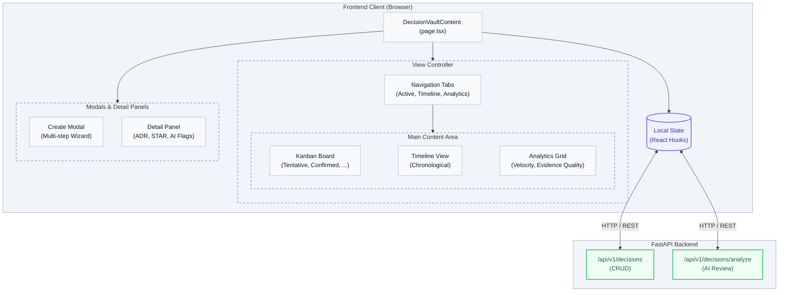
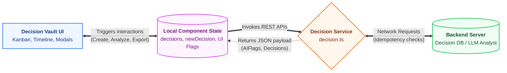

# Decision Vault — Architecture & Developer Documentation

> **Route:** `/decisionvault`  
> **Files:** `page.tsx` · `decisionvault.module.css`  
> **Agent:** documentation-expert  
> **Audience:** Frontend developers, engineering managers, architects

---

## Table of Contents

1. [Overview](#1-overview)
2. [Directory Structure](#2-directory-structure)
3. [High-Level Architecture Diagram](#3-high-level-architecture-diagram)
4. [Layout System](#4-layout-system)
5. [State Management](#5-state-management)
6. [Service Layer](#6-service-layer)
7. [Component Reference](#7-component-reference)
8. [Key Flows](#8-key-flows)
9. [AI & Analytics Integration](#9-ai--analytics-integration)
10. [Data Flow Diagram](#10-data-flow-diagram)

---

## 1. Overview

**Decision Vault** (`/decisionvault`) is the intelligence layer for engineering reasoning within EngUnityCore. It acts as a centralized dashboard to track, evaluate, and analyze technical, product, and architectural decisions. It provides features like AI-driven adversarial reviews, automated Architecture Decision Record (ADR) exports, and STAR format analysis.

| Feature | Implementation |
|---|---|
| View Modes | Kanban (Active), Timeline, Analytics |
| AI Integration | Adversarial checks, STAR analysis, Drift detection |
| Cross-Module Integration | URL search parameters (`?source=chat&title=...`) |
| Layout | Responsive Flexbox/Grid (`.vaultTheme`) |
| Theming | Scoped via `decisionvault.module.css` |

---

## 2. Directory Structure

```text
frontend/src/app/(dashboard)/decisionvault/
├── page.tsx                  ← Root Decision Vault application
├── decisionvault.module.css  ← Scoped CSS module

frontend/src/services/
└── decision.ts               ← REST client & types for Decision operations
```

---

## 3. High-Level Architecture Diagram



---

## 4. Layout System

The `DecisionVaultContent` component manages the UI layout natively through standard React component rendering driven by `decisionvault.module.css`.

### Main Areas

| Component | Class | Description |
|---|---|---|
| Main Container | `.vaultTheme` | Root wrapper defining the theme scale and colors. |
| Header & Nav | `.header` / `.nav` | Sticky top navigation to switch between View Modes. |
| Sub-Header | `.subHeader` | Search input (`.searchWrapper`) and filter controls. |
| Content Area | `.content` | Holds Kanban (`.kanbanBoard`), Timeline (`.timeline`), or Analytics grids. |
| Detail Panel | `.detailOverlay` / `.detailPanel` | Slide-over panel containing full decision context, ADR exports, and AI analysis. |

---

## 5. State Management

The module relies entirely on **React Local State (`useState`, `useMemo`)** and interacts dynamically with URL Parameters for cross-module orchestration.

### Key State Branches

```ts
// View and Core Data
const [viewMode, setViewMode] = useState<'active' | 'timeline' | 'analytics'>('active');
const [decisions, setDecisions] = useState<Decision[]>([]);
const [selectedDecision, setSelectedDecision] = useState<Decision | null>(null);

// Creation Wizard State
const [currentStep, setCurrentStep] = useState(1);
const [newDecision, setNewDecision] = useState<Partial<Decision>>(buildInitialDecision());

// Multi-state Loading & Analysis UI
const [isSubmitting, setIsSubmitting] = useState(false);
const [isGeneratingFlags, setIsGeneratingFlags] = useState(false);
const [activeAnalysis, setActiveAnalysis] = useState<'none' | 'star' | 'adr'>('none');
```

### URL Parameter Integration (Context Passing)
The page utilizes `useSearchParams` via `useEffect` to capture external triggers. If a user creates a decision from a chat session or a code review, the parameters (`?source=chat&title=...&problem=...`) automatically mount the Create Modal and prefill the states.

---

## 6. Service Layer

**File:** `src/services/decision.ts`

### Typical API Interactions

| Operation | Implementation Focus |
|---|---|
| Fetch Decisions | `decisionService.getDecisions()` retrieves the entire decision ledger. |
| Create Decision | `decisionService.createDecision()` persists decisions using idempotency keys (`createRequestKeyRef`). |
| Analyze Decision | `decisionService.analyzeDecision()` evaluates the drafted decision with the AI for adversarial checks, returning an array of `AIFlag` objects. |

---

## 7. Component Reference

### `DecisionVaultContent` (Root)
The core component housing the header, views, and modals. Computes advanced metrics using `useMemo` for the Analytics view.

### Views
- **Kanban Board**: Groups decisions by Status (`tentative`, `confirmed`, `revisited`, `deprecated`).
- **Timeline**: A chronological list of all recorded decisions.
- **Analytics Grid**: Visualizes calculated metrics such as Decision Velocity, Reversal Rate, Evidence Quality, and Confidence Calibration.

### AI Detail Overlays
When viewing a `selectedDecision`, users can click to dynamically generate:
- **STAR Breakdown**: Situation, Task, Action, Result framing for the decision.
- **ADR Export**: Generates a formatted Markdown Architecture Decision Record.

---

## 8. Key Flows

### 8.1 Module Entry & Cross-App Hooks

```
Component Mounts
  ├─ useEffect runs loadDecisions() -> fetch from Backend
  └─ useEffect checks URL params (`useSearchParams`)
       ├─ Found `source`, `title`, or `problem`
       │    ├─ Sanitize inputs
       │    ├─ set setShowCreateModal(true)
       │    └─ Pre-fill `newDecision` state
       └─ Normal load
```

### 8.2 AI Review & Creation Flow

```
User completes steps 1-4 (Identity, Context, Options, Evidence)
  └─ Clicks "Next" to Step 5 (Analysis) -> Triggers Step 6 (AI Review)
       ├─ generateAIFlags() fires `decisionService.analyzeDecision()`
       ├─ Backend LLM performs adversarial checks
       ├─ Returns `AIFlag[]` (Warnings, Critical issues, Recommendations)
       └─ User completes Resolution step -> Creates Decision
```

---

## 9. AI & Analytics Integration

The module acts as an analytical tool tracking user decision efficacy over time.

- **Confidence Calibration**: Compares the user's reported `confidence` (`low`, `medium`, `high`) against the eventual decision `status` (e.g., Confirmed vs. Deprecated).
- **Decision Drift**: AI pattern detection that flags if multiple related architectural decisions are being reversed frequently.
- **Adversarial Checks (`ai_flags`)**: Validates risk levels, hidden tradeoffs, and optimism biases prior to submitting a final decision.

---

## 10. Data Flow Diagram



---

*Generated by documentation-expert agent · EngUnityCore*
